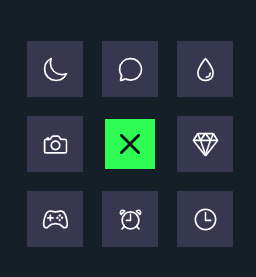

# 9-Dot Expandable Navigation Bar

## 📌 Project Overview
This project is a **9-dot expandable navigation bar** that expands upon clicking, revealing different app icons arranged in a 3x3 grid. It provides a **smooth user experience** with interactive animations.

## 🌟 Features
- **Expandable 9-dot menu** that opens upon clicking.
- **Smooth animations** for an engaging UI.
- **Easy-to-customize** icons for different apps.
- **Responsive design** that works on all screen sizes.

## 🛠️ Technologies Used
- **HTML**
- **CSS** (for styling and animations)
- **JavaScript** (for interactivity)

## 🚀 How to Use
1. Click on the **9-dot menu icon**.
2. The navigation bar will **expand**, displaying 9 app icons.
3. Click on any icon to navigate to the respective app.
4. Click again outside the menu to **collapse** it.

## 📂 Project Structure
```
Navigation_Bar/
│── index.html   # Main HTML file
│── style.css    # Styles for the navigation bar and animation effects
│── script.js    # JavaScript for handling menu interactions
└── assets/      # (Optional) Store icons or images here
```

## ▶️ How to Run
1. **Clone the repository**:
   ```bash
   git clone https://github.com/yashpatil-1/Navigation_Bar.git
   cd Navigation_Bar
   ```
2. **Open `index.html`** in any browser.
3. Click on the 9-dot menu and explore!

## 📸 Screenshots
 

## 🎯 Future Enhancements
- Add **smooth transitions** with **GSAP animations**.
- Implement **customizable app links** for dynamic content.
- Improve **mobile responsiveness**.

## 🤝 Contributing
Feel free to **fork this repo** and contribute! Open a pull request with improvements.

## 📜 License
This project is licensed under the **MIT License**.

## 📞 Contact
For queries, reach out via **[workwithme.3215@gmail.com](mailto:workwithme.3215@gmail.com)** or visit my **[GitHub Profile](https://github.com/yashpatil-1)**.

---
🚀 **Happy Coding!**